# codeceptjs-xray-cloud-helper

[](https://badge.fury.io/js/codeceptjs-xray-cloud-helper)

## Context

**codeceptjs-xray-cloud-helper** is a [CodeceptJS](https://codecept.io/) plugin that automatically retrieves the results of CodeceptJS tests and sends them to XRAY/JIRA via [XRAY Cloud API](https://docs.getxray.app/display/XRAYCLOUD/Import+Execution+Results+-+REST+v2#ImportExecutionResultsRESTv2-XrayJSONresults).

**Works Only with XRAY/JIRA cloud version.**

Refer to [hands-on-codeceptjs-xray-cloud-helper](https://github.com/saadichouaib/hands-on-codeceptjs-xray-cloud-helper) to see test examples and how the plugin could be implemented.

## Setup

```
npm install codeceptjs-xray-cloud-helper
```

## Usage

This helper supports sending results of automated tests to all Xray test types:

- Generic
- Manual
- Manual with iterations
- Cucumber scenario
- Cucumber scenario outline

It allows you to:

- Send the results to an existing "Test Execution"
- Send the results to a new "Test Execution" created by the helper
- Link the Codecept scenario to an existing Jira test (Generic, Cucumber or Manual)
- Automatically create Jira tests during execution (valid only for Generic and Manual tests)
- Perform a bulk import of Cucumber tests from the CLI, which allows automatic creation of Cucumber tests in Jira
- Automatically send a screenshot of the error as an "evidence" if the test fails
- Link the "Test Execution" to a specific test plan
- Enter all fields of the "Test Execution"
- Send data to the "custom fields" of the Test Run

## Configuration
Choose between the following two options: **"Quickstart"** ou **"Manual configuration"**.

### Quickstart
Use the command line to help you automatically generate the config by answering questions.

```
npx xray-import init
```

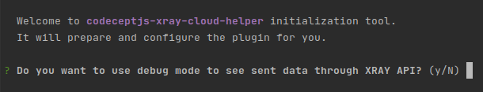

### Manual configuration
Manually add and modify the following config in the file `codecept.conf.js`.
```
plugins: {
    xrayImport: {
        require: "codeceptjs-xray-cloud-helper",
        enabled: true,
        debug: false,
        projectKey: "JIRAKEY",
        testExecutionAssigneeUserId: "604ba41b020eb0068634",
        importToExistingTestExecution: true,
        existingTestExecutionKey: "JIRAKEY-1118",
        testExecutionPlanKey: "",
        testExecutionVersion: "",
        testExecutionRevision: "",
        testExecutionEnvironments: ["QA"],
        testExecutionSummary: "Execution of automated tests",
        testExecutionDescription: "This execution was automatically created when importing execution results",
        testExecutionSendEvidenceOnFail: true,
        testExecutionCustomFields: [{ id: "63c5731047c0ed24ee469f5b", value: "local" }],
        createNewJiraTest: false,
        timeout: 120000,
        xrayClientId: '74122128E033FD4efef42341E2B1DF70A6027BD799',
        xraySecret: '28e15830390194549bazzea0ce461274eabb71119113096ba3d746'
    },
}
```
#### Possible config fields :

| Config field                   | Required          | Type    | Description                                                                                                                                                              |
| ------------------------------ | ----------------- |---------| -------------------------------------------------------------------------------------------------------------------------------------------------------------------------|
| debug                          | yes               | boolean | Set to true to see the payload sent and the response received from XRAY                                                                                                  |
| projectKey                     | yes (only if)     | string  | The Jira project ID (required if `createNewJiraTest` is true)                                                                                                            |
| testExecutionAssigneeUserId    | no                | string  | The userId of the "Test Execution" assignee field                                                                                                                        |
| importToExistingTestExecution  | yes               | boolean | Choose whether or not to import results into an existing "Test Execution"                                                                                                |
| existingTestExecutionKey       | yes (only if)     | string  | The existing test execution key where to send the test results (required if `importToExistingTestExecution` is true)                                                     |
| testExecutionPlanKey           | no                | string  | To link the test execution to a "Test Plan"                                                                                                                              |
| testExecutionVersion           | no                | string  | The version to display in the test run                                                                                                                                   |
| testExecutionRevision          | no                | string  | The revision to display in the test run                                                                                                                                  |
| testExecutionEnvironments      | no                | array   | The environment that will be linked to the test run (the environment can be configured from xray app settings on Jira)                                                   |
| testExecutionSummary           | yes               | string  | The title of the test execution (it also replaces the title if it is an existing test execution). Leave blank to not overwrite the existing title                        |
| testExecutionDescription       | yes               | string  | The description of the test execution (it also replaces the description if it is an existing test execution). Leave blank to not overwrite the existing description      |
| testExecutionSendEvidenceOnFail| yes               | boolean | `true` a screenshot of the error associated with the test will be sent to Xray (Plugin screenshotOnFail required)                                                        |
| testExecutionCustomFields      | no                | array   | To send data to the custom fields of the test run                                                                                                                        |
| createNewJiraTest              | yes               | boolean | `false:` results are linked to Jira test using @TEST_ tag. `true:` create a new Jira ticket.                                                                             |
| timeout                        | yes               | number  | Xray API timeout                                                                                                                                                         |
| xrayClientId                   | yes               | string  | To be requested from your Jira admin                                                                                                                                     |
| xraySecret                     | yes               | string  | To be requested from your Jira admin                                                                                                                                     |

## Linking a CodeceptJS scenario to a Jira test (Generic, Manual, Cucumber)
**Prerequisite:** **createNewJiraTest** is set to **false** in the config 

To link a Codecept scenario to a Jira test, you need to add a tag that starts with **"@TEST_"**.

**Note:** The tag should be added only to the scenario concerned and not to the feature.

Follow these examples depending on test types:

### Generic tests

In this example, the result sent during the import will be linked to the JIRAKEY-1110 ticket.

```javascript
Feature('@generic');

Scenario('Generic test', ({ I }) => {
    I.say("Hello");
    I.setRequestTimeout(120000);
    I.assertEqual(true, true);
}).tag("@TEST_JIRAKEY-1110");
```

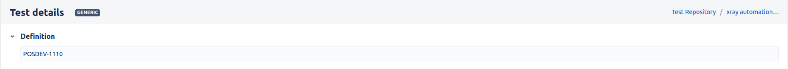

### Manual tests
#### Manual tests with steps
To link a codeceptJS test with a Jira Manual test, you must first add the following plugin to `codecept.conf.js`:

```
plugins: {
    commentStep: {
      enabled: true,
      registerGlobal: 'xray_'
    }
}
```
This plugin allows linking the Jira test steps to the codecept scenarios.

To define the limit of steps, you need to add keywords starting with **xray_\`step...\`** to the codecept scenario (see the example below).

This way, the helper will be able to import the correct status and error message to the specific step, giving more details on Xray (see the descriptive image below).

In this example, the result sent during the import will be linked to the JIRAKEY-1137 ticket with the result of each step.

```javascript
Feature('@manual');

Scenario('Manual test', async({ I }) => {

    xray_`step1`;
    I.setRequestTimeout(3000);
    I.assertEqual(true, true);

    xray_`step2`;
    I.setRequestTimeout(3000);
    I.assertEqual(true, true);

    xray_`step3`;
    I.setRequestTimeout(3000);
    I.assertEqual(true, true);

}).tag("@TEST_JIRAKEY-1143");
```

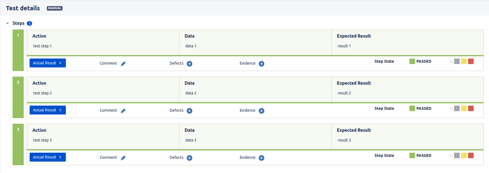

#### Manual tests with steps and iterations (Data driven tests)
Xray tests that contain datasets are initially considered as manual tests with steps.

Therefore, it is necessary to follow the previous chapter to configure the `commentStep` plugin and define the limit of steps in your scenario.

To match a codecept scenario with a "Manual + Datasets" test, you must integrate a DataTable into the scenario as in the following example:

In this way, the helper will be able to send the result of each iteration to Xray.

```javascript
Feature('@data_driven');

let accounts = new DataTable(['username', 'password', 'valid']);
accounts.add(['user1','1234','valid']);
accounts.add(['user2','12345','valid']);
accounts.add(['user3','123456','valid']);

Data(accounts).Scenario('Manual test with dataset (itérations)', async({ I, current }) => {

    xray_`step1`;
    I.assertEqual(true, true);

    xray_`step2`;
    I.assertEqual(current.valid, 'valid');

}).tag("@TEST_JIRAKEY-1137");
```

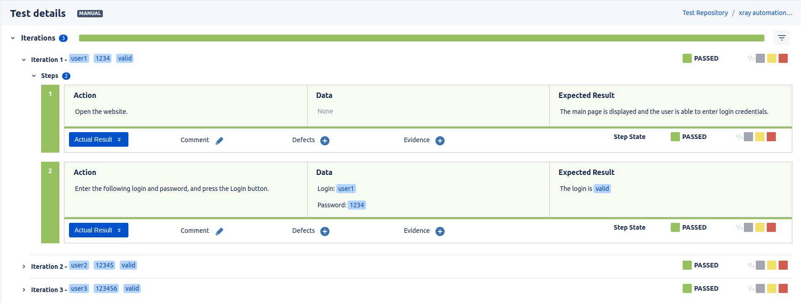

To learn more about "CodeceptJS Data Driven Tests" : **[Doc codeceptJS](https://codecept.io/advanced/#data-driven-tests)**.

### Cucumber tests

#### Cucumber scenario
```gherkin
@nominal_scenario
Feature: Subscribers see different articles based on their subscription level

  @TEST_JIRAKEY-1138
  Scenario: Cucumber scenario test
    Given I visit "login"
    When I enter "Bob" in the "user name" field
    Then I should see the "welcome" page
```

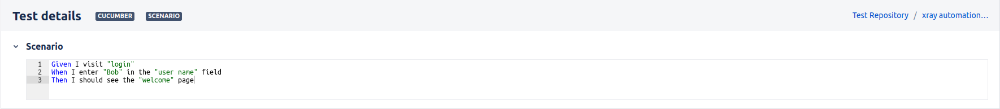

#### Cucumber scenario outline

In the case of a Cucumber test of type Scenario Outline, the helper automatically distinguishes between the different examples and imports the result of each example to Xray (see the screenshot below).
```gherkin
@nominal_outline
Feature: Google Searching
  As a web surfer,
  I want to search Google,
  so that I can learn new things.

  Scenario Outline: Cucumber scenario outline test
    Given a web browser is on the Google page
    When the search phrase "<phrase>" is entered
    Then results for "<phrase>" are shown
    @TEST_JIRAKEY-1139
    Examples:
      | phrase   |
      | panda    |
      | unit     |
      | e2e      |
      | whitebox |
```

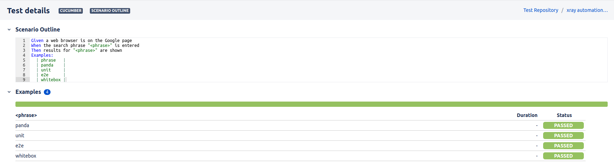

## Automatic import of screenshots

### Configuration

To enable the automatic import of screenshots after a test failure, you must first add the following plugin to `codecept.conf.js` :

It is important to add the `uniqueScreenshotNames` option so that the helper can send multiple screenshots for the same test (in the case of `Scenario outline` and `Manual tests avec itérations`).

```
plugins: {
    screenshotOnFail: {
      enabled: true,
      uniqueScreenshotNames: true
    }
}
```

Then you need to activate the option from the xrayImport helper in `codecept.conf.js` :

```
plugins: {
    xrayImport: {
      testExecutionSendEvidenceOnFail: true
    }
}
```

### Results

Below are some examples of importing failed tests with screenshots and error messages injected into the comment of the test run.

#### Generic test
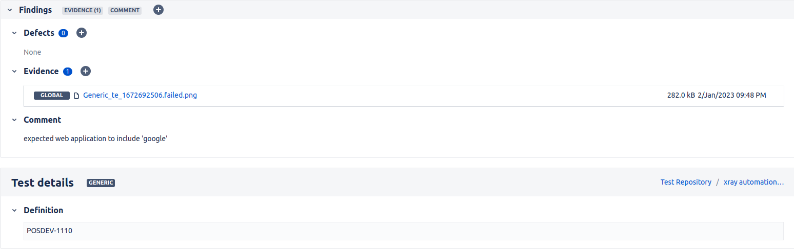

#### Manual test
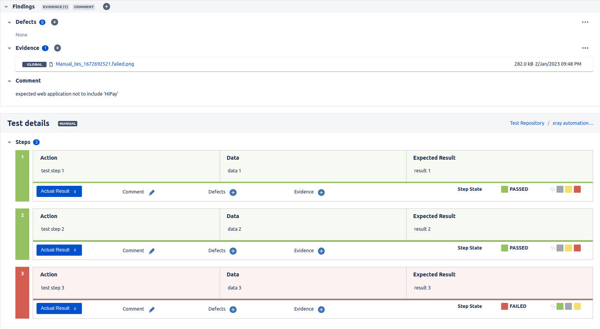

#### Manual with iterations
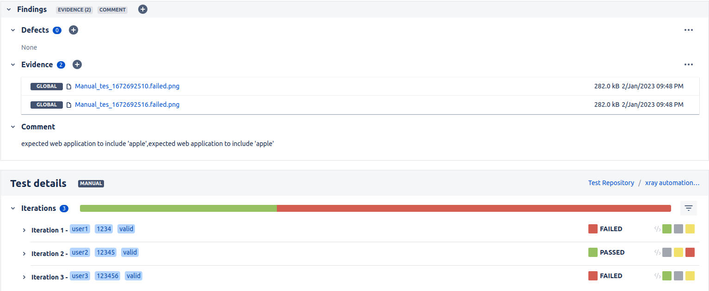

#### Cucumber scenario
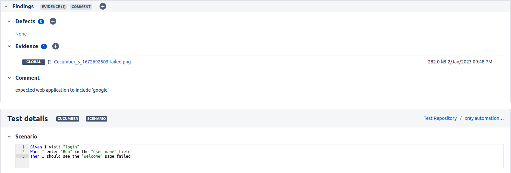

#### Cucumber scenario outline
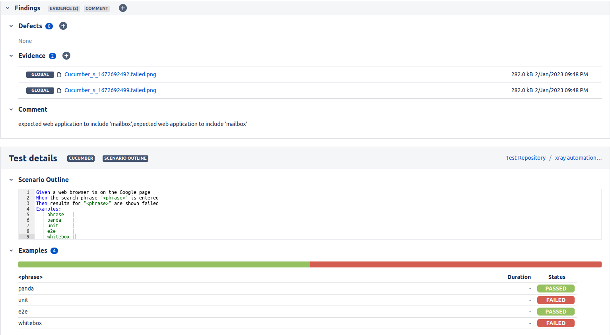

## Automatic creation of test tickets on Jira

### Manual and Generic tests

One of the possible uses of this helper is the automatic creation of test tickets on Jira before importing the codecept test results:

- Start by modifying the configuration on `codecept.conf.js` in the `plugins.xrayImport` section as follows :

The **"projectKey"** is mandatory when `createNewJiraTest: true`. 
```
{
    projectKey: "JIRAKEY",
    createNewJiraTest: true,
}
```

- Then create a codecept scenario and make sure not to put a tag starting with @TEST_ (because logically this scenario is not yet linked to a test on JIRA)

```javascript
Scenario('[Auto created test] Generic test - Passed', ({ I }) => {
    I.say("Ce test n'est pas pas encore de correspondant sur JIRA");
    I.assertEqual(true, true);
}).tag("@generic");
```

```javascript
Scenario('[Auto created test] Manual test - Passed', async({ I }) => {

    xray_`Open the Change Password screen by selecting option`;
    I.setRequestTimeout(3000);
    I.assertEqual(true, true);

    xray_`Fill the password field`;
    I.setRequestTimeout(3000);
    I.assertEqual(true, true);

    xray_`Check the result`;
    I.setRequestTimeout(3000);
    I.assertEqual(true, true);

}).tag('@manual');
```

- Run codecept tests
- Once the import of the results is complete, we notice that the Jira test has been automatically created and linked to the testExecution
- Now, all that remains is to add the @TEST_ tag to the Codecept scenario corresponding to the Jira ticket that has just been created to avoid creating another duplicate ticket during the next execution

**Note:** 
- The helper will try to create a Jira test ticket only if the codecept scenario does not have a `@TEST_` tag and `createNewJiraTest: true`
- If the codecept scenario does not have a `@TEST_` tag and `createNewJiraTest: false` in the config, the scenario result will be simply ignored during the import

### Cucumber tests

Another possible use of this helper is the automatic creation/modification of Cucumber scenarios on Jira from a `.feature` file.

This action can be performed directly with the help of the CLI.

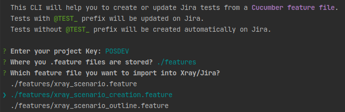

#### Usage :

First, you need to prepare the feature file that you want to import to Xray/Jira.

Here are some rules to keep in mind:

- If the scenario contains a `@TEST_` tag
    - If the test already exists on Jira, the helper will modify it
    - If the test does not exist on Jira, an error will be returned
- If the scenario doesn't contain `@TEST_` tag
    - The helper will try to find a test that matches our scenario (same summary, steps...)
        - If it finds it, it will modify it
        - If it doesn't find it, it will create a new Jira test

For more information, please see the complete documentation: [doc xray](https://docs.getxray.app/display/XRAYCLOUD/Importing+Cucumber+Tests+-+REST+v2).

In the example below:

- A precondition will be created because **Background** is not annotated
- The `JIRAKEY-1138` test will be modified on Jira
- The `Cucumber scenario test failed` scenario will be created on Jira, and the `login` tag will be added as a label
- All tests will be linked to the `JIRAKEY-989` user story and to the created precondition

```gherkin
@REQ_JIRAKEY-989
Feature: Subscribers see different articles based on their subscription level

  Background:
        Given that the calculator is turned on
        And the mode is to advanced
    
  @TEST_JIRAKEY-1138
  Scenario: Cucumber scenario test
    Given I visit "login"
    When I enter "Bob" in the "user name" field
    Then I should see the "welcome" page
    
  @login
  Scenario: Cucumber scenario test failed
    Given I visit "login"
    When I enter "Bob" in the "user name" field
    Then I should see the "welcome" page failed
```

The keywords to use in the feature file are:

- `@REQ_`: to be placed before the feature to link tests to a Jira user story
- `@PRECOND_`: to be placed before the `Background` to link it to a Jira precondition
- `@TEST_`: to be placed before the scenarios/scenario outlines to link them to Jira tests

To import Cucumber tests, run the following command:

```
npx xray-import cucumber
```

- Enter the key of the Jira project where we want to create the tests
- Enter the directory that contains the feature files
- Choose the file that contains the tests we want to create/modify on Jira


## Results

Once the configuration is set up and the `@TEST_` tags are in place, we can run the codeceptJS tests.

A validation of the helper's configuration is performed using the conf_schema_checker.

At the end of each test, the helper retrieves the test status. If the test fails, the error is stored in the comment of the "Test Execution".

When tests are done, the helper makes an Xray API call to import the test results according to the given configuration.

```shell
  OK  | 1 passed 

> Tests results were sent to XRAY on TestExecution : JIRAKEY-1130
```

## Contribution et Guidelines

- **Branch naming convention** : Follow gitflow best practices
- [_//TODO_] **Merge request** : Use **mytemplate** template when creating an MR to see the best practices to follow.
